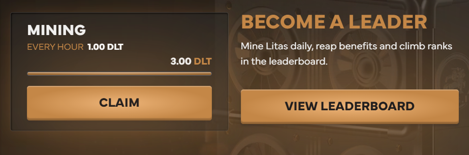
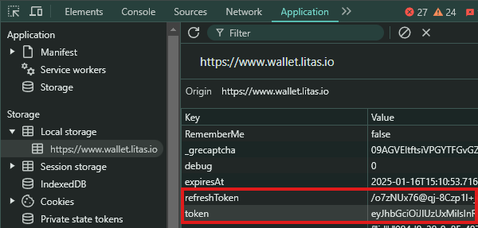

# Litas Auto Claim and Start Mining


## Features

- **Auto Start/Claim Mining**
- **Support multiple accounts**
- **Support Proxy usage**

## Prerequisites

- Node.js installed on your machine
- `tokens.txt` file containing token and refresh token follow instruction below to get:
- Open litas dashboard [https://www.wallet.litas.io](https://www.wallet.litas.io/invite/zlkcyber)
- Login With your email
- inspect or just F12, and find Application
- in local storage find `token` and `refreshToken` and copy all both value.
    

## Installation

1. Clone the repository:
    ```sh
    git clone https://github.com/Zlkcyber/litasBot.git
    cd litasBot
    ```

2. Install the required dependencies:
    ```sh
    npm install
    ```
3. Input your tokens in `tokens.txt` file, one user per line format `token|refreshToken`
    ```sh
    nano tokens.txt
    ```
4. optionally you can use proxy: 
- paste proxy in `proxy.txt` format `http://username:password@ip:port` 
    ```sh
    nano proxy.txt
    ```
5. Run the script:
    ```sh
    npm run start
    ```

## 

This project is licensed under the [MIT License](LICENSE).